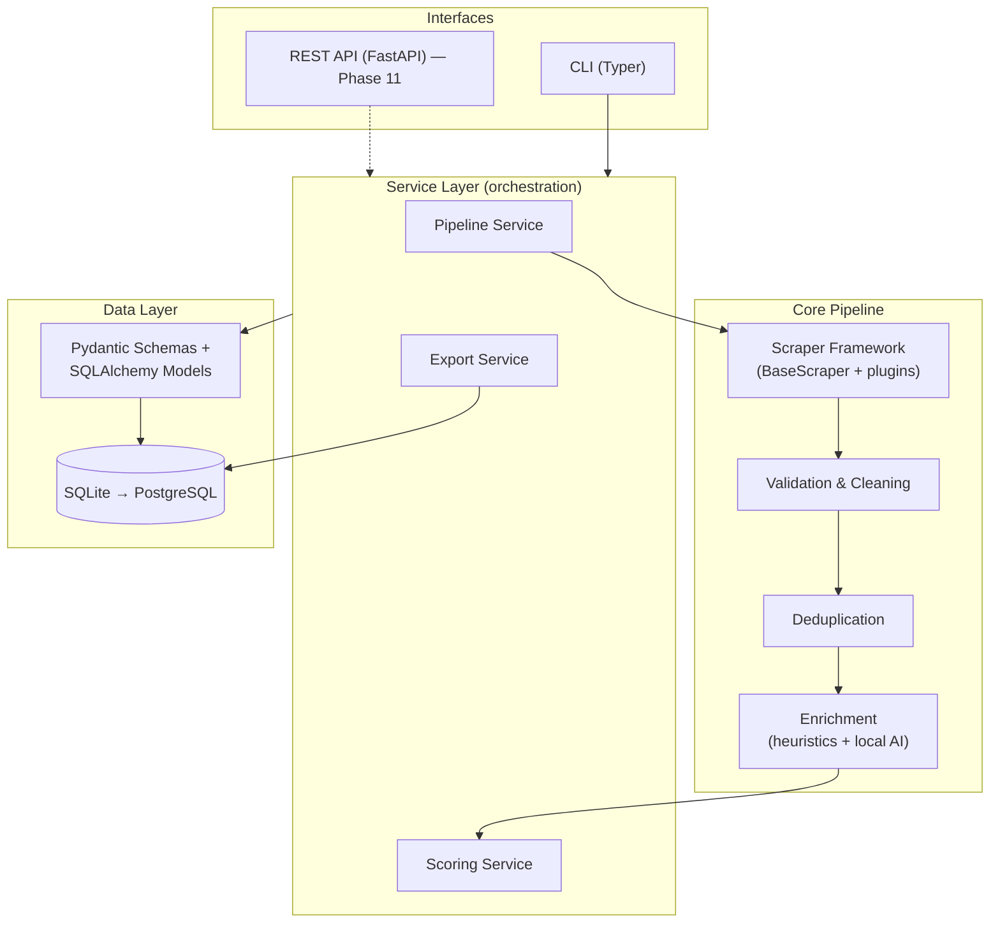
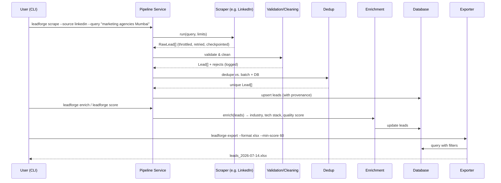

# LeadForge — AI Lead Generation Platform

> **Automated, compliance-aware lead generation for digital marketing agencies.**
> Discover businesses, extract public information, enrich profiles, score leads, and export outreach-ready datasets — without paid APIs.

**Status:** Pre-alpha (Phase 1) · **Language:** Python 3.11+ · **License:** Proprietary (TBD)

---

## Table of Contents

1. [Executive Summary](#1-executive-summary)
2. [Product Vision](#2-product-vision)
3. [The Business Problem](#3-the-business-problem)
4. [Goals & Non-Goals](#4-goals--non-goals)
5. [MVP Scope (v0.1)](#5-mvp-scope-v01)
6. [Legal & Compliance Position](#6-legal--compliance-position)
7. [System Architecture](#7-system-architecture)
8. [Data Flow](#8-data-flow)
9. [Folder Structure](#9-folder-structure)
10. [Data Model](#10-data-model)
11. [Tech Stack](#11-tech-stack)
12. [The Scraper Framework](#12-the-scraper-framework)
13. [LinkedIn Sources — Design & Constraints](#13-linkedin-sources--design--constraints)
14. [Intent Signals (Post-Based Leads)](#14-intent-signals-post-based-leads)
15. [Enrichment & AI Features](#15-enrichment--ai-features)
16. [Lead Scoring](#16-lead-scoring)
17. [Deduplication & Validation](#17-deduplication--validation)
18. [Export System](#18-export-system)
19. [Installation](#19-installation)
20. [Configuration & Environment Variables](#20-configuration--environment-variables)
21. [Usage (CLI)](#21-usage-cli)
22. [Error Handling & Logging](#22-error-handling--logging)
23. [Testing Strategy](#23-testing-strategy)
24. [Coding Standards](#24-coding-standards)
25. [Development Roadmap](#25-development-roadmap)
26. [Deployment](#26-deployment)
27. [Contribution Guidelines](#27-contribution-guidelines)
28. [Future Enhancements](#28-future-enhancements)
29. [FAQ](#29-faq)

---

## 1. Executive Summary

LeadForge automates the lead-generation workflow that digital marketing agencies currently do by hand: finding businesses, collecting public contact information, researching companies, cleaning spreadsheets, and qualifying leads.

The platform is built as a **modular pipeline**: pluggable *scrapers* discover and extract raw business data from public sources; an *enrichment* layer fills gaps and adds intelligence; *validation, cleaning, and deduplication* stages guarantee data quality; a *scoring* engine ranks leads against an Ideal Customer Profile (ICP); and an *export* layer produces CSV/Excel/JSON/CRM-ready datasets.

Two constraints shape every design decision in v0.x:

1. **Zero paid dependencies.** No paid API keys, no paid proxies, no paid databases. Everything runs locally on free, open-source tooling. AI features use local models (Ollama) or deterministic heuristics.
2. **Compliance-first.** The system only touches publicly available data, respects rate limits, and is architected so any single data source (including LinkedIn) can be disabled or swapped without touching the rest of the pipeline.

The long-term vision is a commercial SaaS. The short-term deliverable is a robust CLI tool that a single agency can run on a laptop.

---

## 2. Product Vision

Agencies should describe *who they want to reach* — an industry, a city, a company size — and receive a clean, deduplicated, scored, outreach-ready lead list. Not in days of manual research. In minutes.

**Guiding principles:**

- **Pipeline over product.** Every feature is a stage in a data pipeline. Stages are independent, testable, and replaceable.
- **Sources are plugins.** LinkedIn today; Google Maps, directories, and company websites tomorrow — all behind one `BaseScraper` interface.
- **Quality over quantity.** 200 verified, scored leads beat 20,000 junk rows. Every record carries a `data_quality_score` and provenance (`lead_source`, `last_updated`).
- **Local-first, SaaS-later.** v0.x runs entirely on one machine with SQLite. The architecture (repository pattern, service layer, config-driven sources) is deliberately shaped so a FastAPI + PostgreSQL + multi-tenant SaaS can grow out of it without a rewrite.

---

## 3. The Business Problem

Digital marketing agencies, freelancers, and B2B sales teams burn hundreds of hours per month on:

| Manual Task | Time Sink | LeadForge Stage |
|---|---|---|
| Searching LinkedIn / directories for companies | Very high | **Discovery** (scrapers) |
| Finding websites, emails, phone numbers | High | **Extraction** |
| Researching company background, size, services | High | **Enrichment** |
| Building and cleaning Excel sheets | Medium | **Validation + Export** |
| Removing duplicates across lists | Medium | **Deduplication** |
| Qualifying which leads are worth outreach | High | **Scoring** |

The output of that manual process is usually inconsistent, duplicated, and stale. LeadForge replaces it with a repeatable, auditable pipeline.

**Primary users:** digital marketing agencies, lead-gen agencies, freelancers, B2B sales teams, startup founders, outreach specialists, business development teams.

---

## 4. Goals & Non-Goals

### Goals

- ✅ Discover companies from public sources based on search criteria
- ✅ Extract public business information (contact info, socials, description, location)
- ✅ Enrich profiles (industry classification, tech stack detection, missing-data detection)
- ✅ Validate, clean, and deduplicate all data
- ✅ Score leads against a configurable ICP
- ✅ Export to CSV, Excel, JSON (Google Sheets / CRM formats later)
- ✅ Be extensible: new sources, new enrichers, new exporters as plugins

### Non-Goals (for v0.x)

- ❌ Sending outreach (emails/DMs) — we *prepare* lists, we don't send
- ❌ Scraping data behind logins or paywalls
- ❌ Collecting personal data of private individuals (we target *businesses* and *publicly listed* business contacts)
- ❌ Bypassing CAPTCHAs, bot detection, or IP bans
- ❌ Web dashboard, REST API, multi-user support (deferred to Phase 11+)
- ❌ Paid APIs, paid proxies, cloud infrastructure

---

## 5. MVP Scope (v0.1)

The first shippable version is intentionally narrow, and it is **intent-first**:

> **A CLI tool that finds public LinkedIn posts where someone states a need ("looking for a marketing agency", "need a video editor"), extracts the post and its author, stores them in SQLite, deduplicates, scores by freshness and need-match, and exports an outreach-ready CSV/Excel file.**

| Included in v0.1 | Deferred |
|---|---|
| **LinkedIn public post mining** via search engines ([§13.1](#13-linkedin-sources--design--constraints)) | LinkedIn company pages (Phase 8.5) |
| `IntentLead` model + SQLite storage via SQLAlchemy | Reddit & job-board intent sources (v0.2 — trivial via free API) |
| Typer CLI (`leadforge intent scrape`, `leadforge export` …) | FastAPI, dashboard, PostgreSQL |
| Freshness + need-match scoring (rule-based) | LLM-based scoring |
| Validation, dedup by post URL / author | AI dedup / fuzzy entity resolution |
| CSV / Excel / JSON export | Google Sheets, CRM integrations |
| Structured logging, retry logic, rate limiting | Monitoring stack |

Everything else in this document describes the *target architecture* that v0.1 lays foundations for.

---

## 6. Legal & Compliance Position

**This section is not boilerplate — it constrains the design.**

- **Public data only.** The platform accesses only pages viewable without authentication. No login-walled scraping, ever.
- **LinkedIn specifically:** LinkedIn's User Agreement prohibits automated scraping, and LinkedIn actively enforces it technically (authwalls, rate limits, IP blocks) and legally. Court rulings (e.g., *hiQ v. LinkedIn*) have gone back and forth on scraping *public* pages. **Operators of this software must make their own legal assessment.** The codebase mitigates risk by: never logging in, aggressive rate limiting (human-speed), honoring `robots.txt` awareness in logs, no CAPTCHA bypassing, and making the LinkedIn source trivially easy to disable (`SOURCES_ENABLED` config).
- **Privacy regulations (GDPR / CCPA / DPDP):** We collect *business* contact data from public listings. Records store `lead_source` and `last_updated` for auditability. A `leadforge purge` command supports deletion requests. Users are responsible for lawful use of exported data (e.g., PECR/CAN-SPAM rules for outreach).
- **Rate limiting is mandatory, not optional.** Every scraper runs behind a shared throttle (default: 1 request / 8–15s randomized per domain, hard daily caps).
- **Kill switch per source.** Any source can be disabled by config without code changes.

---

## 7. System Architecture

Clean, layered architecture. Dependencies point inward: scrapers and exporters know about models; models know about nothing.



**Key architectural decisions (and why):**

| Decision | Rationale |
|---|---|
| **Pipeline stages as pure-ish functions** over `Lead` objects | Each stage is unit-testable with fixture data; no stage knows about scraping or the DB |
| **Repository pattern** for DB access | Swap SQLite → PostgreSQL by changing one connection string, not query code |
| **Scrapers return raw `RawLead` dicts; validation converts to typed `Lead`** | Scrapers stay dumb and source-specific; the type boundary is one place |
| **Config-driven source registry** | Enable/disable sources, tune rate limits per source, without code changes |
| **CLI-first, API-later** | Typer commands call the same service layer FastAPI will later — zero duplicated logic |
| **SQLite first** | Zero setup, zero cost, perfectly adequate below ~1M leads; SQLAlchemy makes migration to Postgres mechanical |

---

## 8. Data Flow



Notes:

- **Scrape and enrich are separate commands.** Scraping is slow and fragile; enrichment is fast and local. Decoupling them means a blocked scraper never loses enrichment work, and enrichment can be re-run when logic improves.
- **Checkpointing:** scrapers persist progress (last page, seen URLs) so an interrupted run resumes instead of restarting.
- **Rejects are never silently dropped** — invalid rows go to a `rejects` table with a reason.

---

## 9. Folder Structure

```
leadforge/
├── pyproject.toml              # Single source of deps & tooling config
├── README.md                   # This file — master specification
├── .env.example                # Every env var, documented, no secrets
├── docker-compose.yml          # Optional: containerized run (Phase 13)
├── src/
│   └── leadforge/
│       ├── config/             # Pydantic Settings; loads .env; source registry
│       ├── models/             # Pydantic schemas (Lead, RawLead) + SQLAlchemy ORM
│       ├── scrapers/
│       │   ├── base.py         # BaseScraper ABC + throttle, retry, checkpoint mixins
│       │   ├── linkedin/       # LinkedIn public-pages scraper (v0.1)
│       │   ├── intent/         # Intent-signal scrapers: Reddit, public-post mining (Phase 8.5)
│       │   └── registry.py     # Source registry — config-driven enable/disable
│       ├── validation/         # Field validators, normalizers (email, phone, URL)
│       ├── cleaning/           # Text cleanup, canonicalization (names, addresses)
│       ├── deduplication/      # Exact + fuzzy matching (domain, name+city keys)
│       ├── enrichment/
│       │   ├── heuristics/     # Tech-stack detect, industry keywords, completeness
│       │   └── ai/             # Ollama-backed enrichers (optional, feature-flagged)
│       ├── scoring/            # ICP definitions + rule-based scoring engine
│       ├── database/           # Engine, session, repositories, migrations (Alembic)
│       ├── services/           # PipelineService, ScoringService, ExportService
│       ├── exports/            # CSV, XLSX, JSON writers (one class per format)
│       ├── cli/                # Typer app — thin wrappers over services
│       └── utils/              # Logging setup, throttling, retry, user agents
├── tests/
│   ├── unit/                   # Per-module tests with HTML/JSON fixtures
│   ├── integration/            # Pipeline runs against fixture data + temp DB
│   └── fixtures/               # Saved sample pages — tests never hit the network
├── data/                       # SQLite DB + checkpoints (gitignored)
├── exports/                    # Generated files (gitignored)
├── logs/                       # Rotating structured logs (gitignored)
└── docs/                       # ADRs, source-specific notes, legal notes
```

**Module responsibilities (one line each):**

| Module | Owns | Must NOT know about |
|---|---|---|
| `config` | Settings, source registry, feature flags | Everything else |
| `models` | The shape of a Lead; nothing else | Scraping, DB sessions, export formats |
| `scrapers` | Getting raw dicts out of one source | Validation rules, the database |
| `validation`/`cleaning` | RawLead → Lead, normalization | Where data came from or goes |
| `deduplication` | Deciding two leads are the same entity | Scraping, exporting |
| `enrichment` | Adding derived fields to a Lead | CLI, DB internals |
| `scoring` | Ranking leads vs. an ICP config | Sources, exports |
| `database` | Persistence, repositories, migrations | Business logic |
| `services` | Orchestrating stages into workflows | HTML parsing, SQL |
| `exports` | Serializing leads to files | Scraping, scoring logic |
| `cli` | Argument parsing + calling services | Everything below services |

---

## 10. Data Model

Core entity: **`Lead`** (a business profile). Defined once as a Pydantic schema (validation + API later) and mirrored as a SQLAlchemy model (persistence).

```python
class Lead(BaseModel):
    # Identity
    id: UUID
    business_name: str
    website: HttpUrl | None
    domain: str | None            # canonical dedup key when present

    # Classification
    industry: str | None
    category: str | None
    description: str | None
    keywords: list[str]
    services: list[str]
    products: list[str]

    # Location
    country: str | None
    state: str | None
    city: str | None
    postal_code: str | None

    # Contact (public/business only)
    phone: str | None             # E.164 normalized
    email: EmailStr | None        # public contact email only
    linkedin_url: HttpUrl | None
    instagram: str | None
    facebook: str | None
    twitter: str | None

    # Firmographics (public info only)
    company_size: str | None      # e.g. "11-50"
    employee_count_est: int | None
    founder: str | None
    ceo: str | None
    google_rating: float | None
    review_count: int | None
    business_hours: str | None
    tech_stack: list[str]

    # Provenance & quality — every record, always
    lead_source: str              # e.g. "linkedin"
    source_url: HttpUrl
    first_seen: datetime
    last_updated: datetime
    data_quality_score: int       # 0–100, completeness + validity
    lead_score: int | None        # 0–100, ICP fit (scoring stage)
    status: LeadStatus            # new | enriched | scored | exported
```

Supporting tables: `rejects` (failed validation + reason), `scrape_runs` (run metadata, counts, errors — auditability), `checkpoints` (resume state per source/query).

A second entity, **`IntentLead`** — a person or company with a publicly stated need ("looking for a video editor") — is specified in [§14](#14-intent-signals-post-based-leads). Where resolvable, intent leads link back to a company `Lead`.

---

## 11. Tech Stack

Everything below is **free and open source**. No paid keys anywhere.

| Layer | Choice | Why (vs. alternatives) |
|---|---|---|
| Language | **Python 3.11+** | Ecosystem for scraping + data; team skill |
| Browser automation | **Playwright** | Handles JS-heavy pages (LinkedIn), auto-waits, stealthier and more modern than Selenium. *Selenium dropped* — Playwright covers everything it does, better. |
| Static parsing | **BeautifulSoup4 + lxml** | For plain-HTML sources later; never spin up a browser when `requests` suffices |
| HTTP | **httpx** | Modern requests-compatible API, HTTP/2, async-ready for future concurrency |
| Data wrangling | **Pandas** | Exports, dedup batch ops |
| Validation | **Pydantic v2** | Schemas double as settings (`pydantic-settings`) and future API models |
| ORM / DB | **SQLAlchemy 2 + SQLite** (→ PostgreSQL) | Zero-cost start; Alembic migrations from day one so Postgres is a config change |
| CLI | **Typer** | Typed, self-documenting commands |
| AI (optional) | **Ollama** (local Llama/Mistral/Qwen) | The only way to get LLM features with zero API cost; feature-flagged so the platform fully works without it |
| Testing | **Pytest** + saved HTML fixtures | Deterministic tests, no network |
| Lint/format | **Ruff** | One fast tool replaces flake8+isort+black |
| Types | **mypy** | Enforced on `src/` |
| Logging | **structlog** | Structured JSON logs, per-run context |
| CI | **GitHub Actions** | Free tier: lint + type-check + tests |
| Packaging | **Docker** (optional) | Reproducible runs; not required locally |

**Deliberately excluded for now:** Redis (no queue needed for single-machine CLI), FastAPI (Phase 11), Celery, paid proxy services, any SaaS API.

---

## 12. The Scraper Framework

The heart of extensibility. Every source implements one interface:

```python
class BaseScraper(ABC):
    source_name: str

    @abstractmethod
    def discover(self, query: SearchQuery) -> Iterator[str]:
        """Yield candidate profile/listing URLs for a search."""

    @abstractmethod
    def extract(self, url: str) -> RawLead:
        """Extract raw fields from one page. Dumb and source-specific."""
```

The framework (in `scrapers/base.py`) wraps every scraper with non-negotiable cross-cutting behavior:

- **Throttling:** randomized delay per domain (config: `min/max seconds`), global daily request cap per source.
- **Retry with backoff:** transient failures retried (max 3, exponential + jitter); permanent failures logged to `rejects`.
- **Checkpointing:** progress persisted after every N leads; `--resume` continues an interrupted run.
- **Session hygiene:** realistic user agent, viewport, locale; no login; no CAPTCHA solving — a CAPTCHA/authwall means *stop and log*, not evade.
- **Structured run reporting:** every run writes a `scrape_runs` row (query, pages visited, leads found, rejects, errors, duration).

**Adding a new source** = one new folder in `scrapers/`, one registry entry, one fixture-based test file. Nothing else changes.

---

## 13. LinkedIn Sources — Design & Constraints

LinkedIn contributes **two scrapers** behind the same framework. Read [§6 Compliance](#6-legal--compliance-position) first. Both share the hard rules: **no login, no cookies from a real account, no Sales Navigator, no employee/connection scraping, no CAPTCHA or authwall circumvention.** Hitting an authwall increments a counter; N consecutive authwalls cleanly aborts the run with an actionable message.

### 13.1 Public post mining — the v0.1 core

Finds public posts where someone states a need: *"looking for a marketing agency"*, *"need a video editor"*, *"can anyone recommend…"*.

**How it works:**

1. **Discovery via search engines, never LinkedIn's own search** (which is authwalled). We query DuckDuckGo's HTML endpoint first (most scraper-tolerant), Bing/Google as fallbacks, with rotating phrase permutations: `site:linkedin.com/posts "looking for a marketing agency"`, `"need help with marketing" site:linkedin.com`, `"can anyone recommend" marketing site:linkedin.com`. Phrase templates live in config (`intent_queries.yaml`), not code — adding a niche means adding phrases, not code.
2. **Recency filters** on the search-engine side (past week / past month) keep results fresh — critical, because intent decays in days.
3. **Extraction with Playwright** on the public post URL (many render logged-out): post text, author name, author headline, author profile URL, approximate posted-at, reaction/comment counts. Each hit becomes an **`IntentLead`** ([§14](#14-intent-signals-post-based-leads)); the post URL is the dedup key.
4. **Author → company resolution** (enrichment stage): when the author's headline names a company ("Founder at XYZ"), we try to resolve XYZ's website and link the intent lead to a company `Lead`.

**Honest expectations:** search engines index only a slice of LinkedIn posts, and some post URLs authwall anyway. Expect **dozens of quality intent leads per week per niche — not hundreds per day**. But each one is warm: a person who publicly asked for exactly what you sell, days ago. Volume scales by adding phrase permutations, niches, and additional sources (Reddit in v0.2) — never by hammering LinkedIn harder.

### 13.2 Company pages — Phase 8.5

- Targets **public company pages** (`linkedin.com/company/<slug>`), discovered the same search-engine way.
- Extracts what the logged-out page exposes: name, description, industry, size bracket, HQ location, website URL, specialties.
- The extracted **website URL is the pivot**: it becomes the `domain` dedup key and feeds website-based enrichment (emails, phones, tech stack come from the *company's own site* — easier and safer than LinkedIn).
- In the intent-first MVP, this scraper's main job is **enriching an `IntentLead`'s author company**, not bulk discovery. Expect tens of pages per day per IP before authwalls — it's a seed/enrichment source, not a firehose.

---

## 14. Intent Signals (Post-Based Leads)

The second lead type, and often the *warmer* one. A person publicly posting *"I'm looking for a video editor"* or *"need someone for our marketing"* is a lead with a **stated need and a timestamp** — worth far more than a cold company profile. LeadForge captures these as **`IntentLead`** records, distinct from company `Lead`s.

### The IntentLead model

```python
class IntentLead(BaseModel):
    id: UUID
    # Who posted
    author_name: str
    author_profile_url: HttpUrl | None
    author_headline: str | None       # e.g. "Founder at XYZ"
    company: str | None               # linked to a company Lead when resolvable

    # What they need
    need_text: str                    # raw ask, extracted from the post
    need_category: str                # taxonomy: video_editing | marketing | web_dev | design | ...
    post_url: HttpUrl                 # dedup key
    post_text: str
    posted_at: datetime | None
    platform: str                     # reddit | linkedin_public | job_board

    # Actionability
    freshness_score: int              # 0–100, decays fast — intent goes stale in days
    lead_score: int | None            # freshness × need-to-service match
    suggested_angle: str | None       # optional local-AI opener referencing their post

    # Provenance
    first_seen: datetime
    last_updated: datetime
    status: IntentStatus              # new | scored | exported
```

### Intent sources (priority order)

| Priority | Source | Method | Risk / Cost |
|---|---|---|---|
| 1 — **v0.1 core** | **Public LinkedIn posts** | Search-engine mining ([§13.1](#13-linkedin-sources--design--constraints)): `site:linkedin.com/posts "looking for a marketing agency"` → indexed public posts often render logged-out | Low / $0 (modest volume, high warmth) |
| 2 — v0.2 | **Reddit** (r/forhire, r/HireAnEditor, r/freelance_forhire, niche subs) | Free official API — a literal stream of "I need X" posts; the volume backstop | None / $0 |
| 3 | **Job boards** | A public job posting *is* company intent ("they need a marketer now") | None / $0 |
| ❌ | LinkedIn feed/content search (logged-in) | **Never.** Authwalled; scraping it burns accounts, violates ToS, and is legally the weakest ground — see [§6](#6-legal--compliance-position) | Prohibited by design |

### How intent leads are scored

Intent scoring is dominated by **freshness** (configurable half-life, default ~4 days — a "need editor" post is dead in a week) multiplied by **need-to-service match**: the user declares what they sell in `services.yaml` (e.g. `video_editing`, `seo`, `web_development`), and posts are keyword/taxonomy-matched against it.

### Outreach stance (unchanged)

LeadForge **finds and prepares** — it never sends. For each intent lead it can draft (Tier 2, local AI) a personalized opener that references the actual post. Sending is manual: automated LinkedIn DMs are the fastest route to a banned account, and manual, post-referencing outreach converts better anyway.

### Pipeline fit

Intent scrapers implement the same `BaseScraper` interface (same throttling, retries, checkpoints, registry kill switch). Validation and dedup key on `post_url`. Where the author's company website is resolvable, the `IntentLead` is linked to a company `Lead`, unifying both worlds. The LinkedIn post source is the **v0.1 core** ([§13.1](#13-linkedin-sources--design--constraints)); Reddit and job boards follow in v0.2 / Phase 8.5 ([roadmap](#25-development-roadmap)).

---

## 15. Enrichment & AI Features

Enrichment runs **after** persistence and is re-runnable. Two tiers:

### Tier 1 — Deterministic heuristics (always on, zero cost)

- **Industry classification:** keyword taxonomy over name/description/specialties.
- **Tech stack detection** (Phase 5+, from company websites): HTML/header fingerprints (WordPress, Shopify, GA, HubSpot, etc.) — the same technique Wappalyzer uses, implemented with free rule lists.
- **Missing-data detection:** flags which fields are empty and *which source could fill them*.
- **Data quality score:** weighted completeness + validity (valid email domain, live website, phone parses) → 0–100.

### Tier 2 — Local AI via Ollama (optional, feature-flagged `AI_ENABLED`)

- Company profile **summarization** (2-sentence outreach-ready blurb).
- **Category/tag normalization** ("we build websites & apps" → `Web Development`).
- **ICP matching** rationale ("why this lead fits").
- Future: cold-email draft suggestions (generation only — LeadForge never sends).

**Design rule:** every AI enricher has a heuristic fallback or degrades to a no-op. The platform must be fully functional with `AI_ENABLED=false`.

---

## 16. Lead Scoring

Rule-based, transparent, configurable — no black boxes in v0.x.

The user defines an **ICP** in `icp.yaml`:

```yaml
name: "Indian D2C brands needing web dev"
weights:
  industry_match: 30        # industry in [ecommerce, retail, d2c]
  location_match: 20        # city in [Mumbai, Pune, Bangalore]
  size_match: 15            # company_size in [11-50, 51-200]
  has_website: 10
  has_email: 10
  tech_signal: 10           # e.g. on Shopify but no analytics
  data_quality: 5           # scaled from data_quality_score
```

`leadforge score --icp icp.yaml` computes `lead_score` (0–100) per lead and stores the per-factor breakdown, so exports can show *why* a lead scored 85. Multiple ICPs can be scored side by side.

---

## 17. Deduplication & Validation

**Validation (RawLead → Lead boundary):**

- Emails: syntax + domain sanity (MX check optional, offline mode skips it).
- Phones: parsed/normalized to E.164 via `phonenumbers`.
- URLs: normalized (strip tracking params, enforce scheme, extract registered domain via `tldextract`).
- Text: whitespace/encoding cleanup, HTML entity decoding, suspicious-content stripping.
- Anything failing hard rules → `rejects` table with reason. Soft issues → kept, flagged, quality-score penalty.

**Deduplication (three passes, cheapest first):**

1. **Exact domain match** — same registered domain ⇒ same company (strongest key).
2. **Exact key match** — normalized `(business_name, city)`.
3. **Fuzzy match** — `rapidfuzz` token-set ratio on names within the same city/country above a threshold (default 92) ⇒ flagged for merge.

Merging keeps the most complete record and unions the rest (never discards a filled field in favor of an empty one). Merge decisions are logged.

---

## 18. Export System

`ExportService` queries the DB with filters and hands rows to a format writer.

**Filters:** country, state, city, industry, category, company size, keywords, min lead score, min data quality, source, updated-since.

**Formats (v0.1):**

| Format | Writer | Notes |
|---|---|---|
| CSV | stdlib/pandas | UTF-8 BOM for Excel compatibility |
| Excel (.xlsx) | openpyxl | Frozen header, auto-width, score color scale |
| JSON | stdlib | Full records incl. score breakdown |

**Later:** Google Sheets (free API, needs OAuth — Phase 10+), HubSpot/Salesforce/Zoho/Notion/Airtable-compatible CSV column mappings (just column templates — cheap to add).

---

## 19. Installation

```bash
# Requirements: Python 3.11+, Git
git clone <repo-url> leadforge && cd leadforge

python -m venv .venv
# Windows
.venv\Scripts\activate
# macOS/Linux
source .venv/bin/activate

pip install -e ".[dev]"
playwright install chromium

cp .env.example .env        # then edit .env
leadforge init              # creates SQLite DB + runs migrations
leadforge doctor            # verifies environment (browser, DB, optional Ollama)
```

Optional local AI:

```bash
# Install Ollama from https://ollama.com, then:
ollama pull llama3.2:3b     # small, runs on modest hardware
# set AI_ENABLED=true in .env
```

---

## 20. Configuration & Environment Variables

All configuration via `.env` (never committed) + `pydantic-settings`. `.env.example` documents every variable.

| Variable | Default | Purpose |
|---|---|---|
| `DATABASE_URL` | `sqlite:///data/leadforge.db` | Swap to `postgresql://…` later |
| `SOURCES_ENABLED` | `linkedin` | Comma-separated source kill switch |
| `SCRAPE_DELAY_MIN` / `MAX` | `8` / `15` | Per-request randomized delay (seconds) |
| `SCRAPE_DAILY_CAP` | `150` | Max requests per source per day |
| `SCRAPE_HEADLESS` | `true` | Playwright headless mode |
| `AI_ENABLED` | `false` | Toggle Ollama enrichers |
| `OLLAMA_HOST` | `http://localhost:11434` | Local model endpoint |
| `OLLAMA_MODEL` | `llama3.2:3b` | Model for enrichment |
| `LOG_LEVEL` | `INFO` | `DEBUG` for troubleshooting |
| `LOG_FORMAT` | `console` | `json` for machine-readable logs |
| `EXPORT_DIR` | `exports/` | Output location |

**Security rules:** no hardcoded secrets, `.env` gitignored, all user/CLI input validated through Pydantic, no secret ever logged.

---

## 21. Usage (CLI)

```bash
# One-time setup
leadforge init
leadforge doctor

# v0.1 core — mine public LinkedIn posts where someone asks for what you sell
leadforge intent scrape --source linkedin_posts --need "marketing" --since 7d
leadforge intent scrape --source linkedin_posts --need "video editor" --since 30d

# Resume an interrupted run
leadforge intent scrape --resume

# Company pages (Phase 8.5): seed/enrichment source, not a firehose
leadforge scrape --source linkedin \
  --query "digital marketing agency" --location "Mumbai, India" --limit 50

# Enrich everything not yet enriched (heuristics; +AI if enabled)
leadforge enrich

# Score against an ICP
leadforge score --icp icp.yaml

# Inspect
leadforge stats                     # counts by source/status/quality
leadforge show <lead-id>            # full record + score breakdown

# Export
leadforge export --format xlsx --min-score 60 --city Mumbai
leadforge export --format csv --industry "Marketing" --min-quality 50

# More intent sources (v0.2): Reddit's for-hire communities
leadforge intent scrape --source reddit --need "video editor"
leadforge intent export --format csv --min-freshness 70

# Data hygiene
leadforge dedupe --dry-run          # preview merges before applying
leadforge purge --domain example.com  # deletion/opt-out support
```

Every command supports `--help`; every run prints a summary table (found / valid / rejected / duplicates / stored).

---

## 22. Error Handling & Logging

**Philosophy: scrapers fail constantly — the pipeline must not.**

- **Error taxonomy:** `TransientError` (timeout, 5xx → retry), `BlockedError` (authwall, 403, CAPTCHA → abort source run, checkpoint, report), `ParseError` (page layout changed → save HTML snapshot to `logs/snapshots/`, log, skip), `ValidationError` (→ rejects table).
- One bad page never kills a run; N consecutive `BlockedError`s cleanly aborts *that source* with an actionable message.
- **structlog** everywhere: JSON or console format, every log line carries `run_id`, `source`, `url`. Rotating file logs in `logs/`, INFO to console.
- **Snapshot-on-parse-failure** is the single most valuable debugging feature for scrapers: when selectors break (they will), the offending HTML is already saved.

---

## 23. Testing Strategy

| Level | What | How |
|---|---|---|
| Unit | Validators, cleaners, dedup logic, scoring math | Pure pytest, parametrized |
| Unit (scrapers) | `extract()` per source | **Saved HTML fixtures** in `tests/fixtures/` — tests never touch the network |
| Integration | Full pipeline: fixtures → validate → dedupe → score → export | Temp SQLite DB per test |
| Contract | Live smoke test against one real public page | Manual/opt-in only (`pytest -m live`), never in CI |
| CI | Ruff + mypy + unit + integration on every push | GitHub Actions, free tier |

Coverage target: 80%+ on `validation`, `deduplication`, `scoring` (the correctness-critical core). Scraper selectors are expected to break in production — that's what snapshots and fixtures are for.

---

## 24. Coding Standards

- **SOLID / DRY / KISS**, Clean Architecture boundaries as in [§9](#9-folder-structure) — modules only import inward.
- **Type hints mandatory** on all public functions; `mypy` passes in CI.
- **Ruff** for lint + format (line length 100); pre-commit hook provided.
- **Docstrings** on every module and public function — what and *why*, not how.
- **Dependency injection** at service boundaries (repositories, scrapers passed in, not instantiated inside) — this is what makes testing cheap.
- **Conventional Commits** (`feat:`, `fix:`, `refactor:` …).
- **No secrets in Git. Ever.** `.env` only.

---

## 25. Development Roadmap

| Phase | Deliverable | Status |
|---|---|---|
| 1 | Project scaffold: pyproject, config, logging, CI, `leadforge doctor` | 🔜 Next |
| 2 | Configuration system (pydantic-settings, source registry) | Planned |
| 3 | Database: models, repositories, Alembic migrations, `init` | Planned |
| 4 | Scraper framework: BaseScraper, throttle, retry, checkpoints | Planned |
| 5 | **LinkedIn public post mining** — the v0.1 core: `IntentLead` model + search-engine discovery + post extraction ([§13.1](#13-linkedin-sources--design--constraints)) | Planned |
| 6 | Validation & cleaning pipeline | Planned |
| 7 | Deduplication (post URL / author / domain) | Planned |
| 8 | Enrichment: heuristics tier + author→company resolution; optional Ollama tier | Planned |
| 8.5 | More sources: Reddit intent (free API), job boards, LinkedIn company pages ([§13.2](#13-linkedin-sources--design--constraints)), company-website extractor | Planned |
| 9 | Lead scoring (freshness × need-match; ICP yaml for company leads) | Planned |
| 10 | Export system (CSV/XLSX/JSON), CRM column templates | Planned |
| 11 | REST API (FastAPI, same service layer) | Future |
| 12 | Dashboard (server-rendered or lightweight SPA) | Future |
| 13 | Docker deployment, PostgreSQL option | Future |
| 14 | Monitoring (health metrics, run dashboards) | Future |
| 15 | AI automation (outreach drafting, auto-ICP suggestions) | Future |

**Definition of done for v0.1 (end of Phase 10):** a user can run `intent scrape → enrich → score → export` for one niche (e.g. "marketing") and get a clean, scored, outreach-ready Excel file of people who *publicly asked* for that service in the last days — at $0 cost.

---

## 26. Deployment

- **v0.x:** local machine. `pip install -e .`, SQLite, done. Cross-platform (Windows/macOS/Linux).
- **Docker (Phase 13):** single image with Playwright deps baked in; `docker-compose.yml` adds optional Postgres + Ollama services.
- **SaaS path (future):** FastAPI behind a reverse proxy, PostgreSQL, per-tenant DB schemas, job queue (then Redis earns its place), scrape workers isolated per tenant. The repository/service layering in v0.x is what makes this a growth, not a rewrite.

---

## 27. Contribution Guidelines

1. Branch from `main`: `feat/<short-name>` or `fix/<short-name>`.
2. Write/update tests — PRs without tests for logic changes are not merged.
3. `ruff check && ruff format --check && mypy src && pytest` must pass locally.
4. New scrapers must include: fixture HTML, extract tests, registry entry, rate-limit defaults, and a `docs/sources/<name>.md` note covering the source's ToS posture.
5. Conventional Commit messages; PR description explains *why*, not just *what*.

---

## 28. Future Enhancements

- Additional sources: **company websites** (highest value/lowest risk — do this right after LinkedIn), Google Maps, Clutch, Justdial, IndiaMART, Yellow Pages, startup directories.
- Decision-maker identification from public "About/Team" pages.
- Email pattern inference (`first.last@domain`) with confidence scores — *never* guessing presented as fact.
- Google Sheets export, HubSpot/Salesforce/Zoho/Notion/Airtable integrations.
- LLM-assisted fuzzy dedup and entity resolution.
- Outreach draft generation (local AI), campaign-ready segmentation.
- Multi-tenant SaaS: auth, billing, usage quotas, per-tenant ICPs.
- Proxy rotation support *if and when* the operator supplies compliant infrastructure (not bundled).

---

## 29. FAQ

**Q: Is scraping LinkedIn legal?**
A: Contested and jurisdiction-dependent. LinkedIn's ToS forbids it; court outcomes on *public* pages have varied. This project only touches logged-out public pages, rate-limits aggressively, and never evades blocks — but **you** are responsible for your own legal assessment before running it. See [§6](#6-legal--compliance-position).

**Q: Can it find people posting "I'm looking for a video editor" on LinkedIn?**
A: Yes — this is the v0.1 core feature, built the only safe way. LinkedIn's own post search is behind login, and scraping it with a logged-in account gets that account banned — so we never do. Instead we mine search-engine-indexed *public* LinkedIn posts ([§13.1](#13-linkedin-sources--design--constraints)), supplemented later by open platforms (Reddit's for-hire communities, public job boards). Expect dozens of warm leads per week per niche, not thousands per day — each one a person who publicly asked for exactly what you sell. See [§14](#14-intent-signals-post-based-leads).

**Q: Why so slow (8–15s delays, 150/day cap)?**
A: Because burned IPs and blocked runs are slower than patience. Defaults are deliberately conservative; they're configurable, but lowering them raises your risk, not ours.

**Q: Why no paid APIs — wouldn't Clearbit/Apollo/Hunter be easier?**
A: Yes, and the architecture leaves room for them as future enrichers. The v0.x constraint is $0 operating cost, so everything runs on open source + local AI.

**Q: Why SQLite and not PostgreSQL?**
A: Zero setup, zero cost, handles this workload easily. SQLAlchemy + Alembic mean switching is a one-line config change when SaaS phases begin.

**Q: Why is there no dashboard yet?**
A: Data quality is the product. A dashboard on top of bad data is decoration. CLI + Excel exports serve agencies fine until Phases 11–12.

**Q: Does it send emails?**
A: No. LeadForge *prepares* outreach-ready lists. Sending is out of scope by design (deliverability, consent laws, and reputation are a separate product).

---

*This README is the master specification and single source of truth for LeadForge. Update it in the same PR as any architectural change.*
